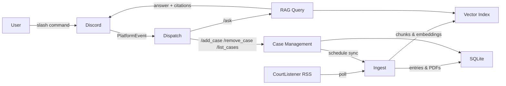

# DocketMind

**AI-powered Discord bot that tracks federal court cases and answers questions about them.**


DocketMind monitors federal lawsuits via [CourtListener](https://www.courtlistener.com/) RSS feeds. When new docket entries appear, it downloads attached PDFs, indexes everything into a vector store, and lets users ask natural-language questions with source citations -- all through Discord slash commands.

## Features

- **Case tracking** -- add any federal case by its CourtListener docket ID
- **Automatic polling** -- RSS feeds are checked on a configurable interval (default: 10 minutes)
- **PDF ingestion** -- attached court documents are downloaded, chunked, and embedded
- **RAG-powered Q&A** -- ask questions and get answers grounded in actual filings, with citations
- **Discord and Slack support** -- admin-gated case management, per-user cooldowns; run either or both side-by-side
- **Async everything** -- built on asyncio end-to-end (discord.py, slack-bolt, httpx, SQLAlchemy, APScheduler)
- **Extensible platform layer** -- a clean Platform adapter contract; auto-discovery of configured adapters at startup

## Architecture



## Commands

| Command | Access | Description |
|---------|--------|-------------|
| `/ask` | Everyone | Ask a question about tracked cases. Optionally scope to a specific case. |
| `/add_case` | Admin | Start tracking a case by CourtListener docket ID. Triggers an immediate backfill. |
| `/remove_case` | Admin | Stop tracking a case, delete all data, and remove cached PDFs. |
| `/list_cases` | Everyone | List all tracked cases with their last sync time. |

## Quick Start

### Prerequisites

- Python 3.13+
- [uv](https://docs.astral.sh/uv/) package manager
- A [Discord bot token](https://discord.com/developers/applications)
- An [OpenAI API key](https://platform.openai.com/api-keys) (for LLM and embeddings)

### Setup

```bash
git clone https://github.com/AidenHadisi/docket-mind.git
cd docket-mind

# Install dependencies
uv sync

# Configure environment
cp .env.example .env
# Edit .env and fill in DISCORD_BOT_TOKEN, LLM_API_KEY, and EMBED_API_KEY

# Run database migrations
uv run alembic upgrade head

# Start the bot
uv run python -m docketmind
```

### Discord Bot Permissions

When creating your bot in the Discord Developer Portal, enable:

- **Scopes:** `bot`, `applications.commands`
- **Permissions:** Send Messages, Use Slash Commands, Embed Links

For development, set `DISCORD_GUILD_ID` in your `.env` so slash commands sync instantly to your test server. In production, leave it unset for global sync (takes up to 1 hour).

## Configuration

All configuration is via environment variables (or a `.env` file). See [`.env.example`](.env.example) for the full template.

### Required

You need credentials for **at least one platform** (Discord or Slack), plus LLM and embedding API keys.

| Variable | Description |
|----------|-------------|
| `LLM_API_KEY` | API key for the LLM provider (OpenAI by default) |
| `EMBED_API_KEY` | API key for the embedding provider (same key if using OpenAI for both) |

### Platform credentials (set at least one)

| Variable | Description |
|----------|-------------|
| `DISCORD_BOT_TOKEN` | Discord bot token |
| `SLACK_BOT_TOKEN` | Slack bot token (`xoxb-...`) |
| `SLACK_APP_TOKEN` | Slack app-level token (`xapp-...`); required for socket mode alongside `SLACK_BOT_TOKEN` |

### Optional

| Variable | Default | Description |
|----------|---------|-------------|
| `DISCORD_GUILD_ID` | *(unset)* | Server ID for instant slash-command sync during development |
| `LLM_PROVIDER` | `openai` | LLM provider: `openai`, `anthropic`, or `mock` |
| `LLM_MODEL` | `gpt-5.4` | Model name passed to the LLM provider |
| `EMBED_PROVIDER` | `openai` | Embedding provider: `openai` or `mock` |
| `EMBED_MODEL` | `text-embedding-3-small` | Model name for embeddings |
| `DATA_DIR` | `data` | Root directory for the SQLite database, vector index, and downloaded PDFs |
| `CHUNK_SIZE` | `1024` | Token chunk size for document splitting |
| `CHUNK_OVERLAP` | `200` | Overlap between chunks |
| `SIMILARITY_TOP_K` | `30` | Number of chunks retrieved by vector search per query (wide candidate pool for postprocessors to filter) |
| `SYNTHESIS_TOP_K` | `8` | Number of chunks that survive postprocessing and are sent to the LLM for synthesis |
| `POLL_INTERVAL_SECONDS` | `600` | RSS poll interval in seconds (minimum 60) |
| `LOG_LEVEL` | `INFO` | Logging level |

## Development

```bash
# Run all tests
uv run pytest

# Run a specific test file
uv run pytest tests/ingest/test_rss.py

# Run tests matching a pattern
uv run pytest -k "test_sync_case"

# Lint and format
uv run ruff check .
uv run ruff format .

# Type check
uv run pyright

# Generate a new database migration
uv run alembic revision --autogenerate -m "description of change"

# Apply migrations
uv run alembic upgrade head
```

Tests use mock providers for the LLM and embeddings, so no API keys are needed to run the test suite.

## Project Structure

```
docketmind/
├── __init__.py          # LlamaIndex LLM and embedding configuration
├── __main__.py          # Application entry point, dispatch, and event loop
├── configure.py         # Pydantic Settings (loads .env)
├── store.py             # SQLAlchemy async models and queries
├── ingest.py            # RSS parsing, PDF download, sync pipeline
├── index.py             # LlamaIndex vector store (upsert, delete, persist)
├── chat.py              # RAG query engine and response formatting
├── schedule.py          # APScheduler job management (per-case polling)
├── commands.py          # CommandSpec, exceptions, handlers, COMMANDS registry
└── platforms/
    ├── __init__.py      # Abstract Platform, BotResponse, create_platforms()
    ├── discord.py       # Discord adapter (slash commands, embeds)
    └── slack.py         # Slack adapter (socket mode, Block Kit)
```

### Data directory (gitignored)

```
data/
├── docketmind.db        # SQLite database
├── index/               # Persisted LlamaIndex vector store
└── pdfs/                # Downloaded court documents, organized by case
```

## How It Works

1. An admin runs `/add_case 72192698` with a CourtListener docket ID.
2. DocketMind fetches the case name from the RSS feed and creates a database record.
3. The scheduler immediately backfills all existing docket entries and starts polling for new ones.
4. For each entry, the text content is embedded into the vector index. If PDFs are attached, they are downloaded, split into pages, and embedded separately.
5. When a user runs `/ask What motions have been filed?`, the query hits the vector store, retrieves the most relevant chunks, and an LLM synthesizes an answer with source citations.

## Deployment

DocketMind is a long-running background process with no public HTTP endpoint (Discord uses websockets, Slack uses socket mode). It needs a small persistent disk for its SQLite database, vector index, and cached PDFs. The included [`Dockerfile`](Dockerfile) and [`fly.toml`](fly.toml) target [Fly.io](https://fly.io), which costs roughly $2–5/month for this workload.

### One-time setup

1. **Install flyctl** and log in:

   ```bash
   brew install flyctl
   fly auth signup        # or: fly auth login
   ```

2. **Create the app** (uses the existing `fly.toml`, no deploy yet):

   ```bash
   fly launch --no-deploy --copy-config --name docketmind --region iad
   ```

   If `docketmind` is taken, pick a different name and update `app =` in `fly.toml`.

3. **Create the persistent volume** (1 GB is plenty to start):

   ```bash
   fly volumes create data --region iad --size 1
   ```

4. **Set secrets** by importing your local `.env`. Comments and blanks are skipped, and tokens never hit your shell history:

   ```bash
   fly secrets import < .env
   ```

   Verify with `fly secrets list`.

### Deploy

```bash
fly deploy
```

Each deploy builds the Docker image and rolls out the new machine. Alembic migrations run on app startup (idempotent — already-applied migrations are no-ops). They run inside the app container so they have access to the mounted `/data` volume.

### Operate

```bash
fly logs                  # tail logs
fly status                # machine status, last deploy, volume info
fly ssh console           # shell into the running machine
fly secrets list          # see configured secrets (values are hidden)
fly volumes list          # check disk usage
```

To grow the volume later: `fly volumes extend <volume-id> --size 5`.

## License

[MIT](LICENSE)
